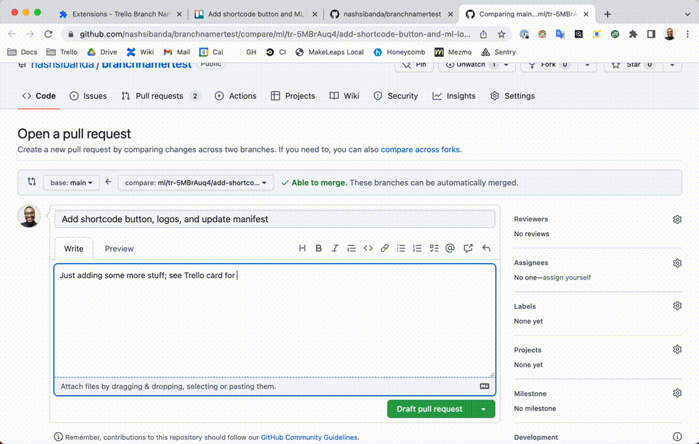

# GitHub-PR-To-Trello-Card

**GitHub Action to attach GitHub pull requests to a Trello card based on branch name**

Includes a [helper extension for Chrome](chrome_extension/), to make creating branch names super easy.



#### Forked from

[https://github.com/marketplace/actions/github-commit-to-trello-card](https://github.com/marketplace/actions/github-commit-to-trello-card)

## Installation

#### Action Secrets

Add these secrets to the repository you wish to use this integration with.

> Settings > Secrets and variables > Actions > New Repository Secret

- **TRELLO_KEY** - Trello API key, visit https://trello.com/app-key for key
- **TRELLO_TOKEN** - Trello auth token, visit https://trello.com/app-key then click generate a token

#### GitHub Action

In the root of your Github-stored repo, add the file `.github/workflows/pr-to-trello.yml` containing the following:

```
name: GitHub Commit To Trello Comment

on:
  pull_request:
    types: [opened]

jobs:
  build:
    runs-on: ubuntu-latest

    steps:
      - uses: actions/checkout@v2

      - uses: nashsibanda/github-pr-to-trello-card@main
        with:
          trello-api-key: ${{ secrets.TRELLO_KEY }}
          trello-auth-token: ${{ secrets.TRELLO_TOKEN }}
          github-token: ${{ secrets.GITHUB_TOKEN }}
```

The action should be up and running!

## Action Variables

These can be found in the `with:` section of the action .yml file:

- **trello-api-key** - Trello API key, visit https://trello.com/app-key for key
- **trello-auth-token** - Trello auth token, visit https://trello.com/app-key then click generate a token
- **trello-card-id-pattern** - Custom JS-compatible regex pattern to extract Trello card shortcode from branch name. Defaults to /tr-{shortcode}/
- **github-token** - Github token, needed to add comments/links to PRs. Automatically added by Github.

#### Local Build

```
npm run build
```
