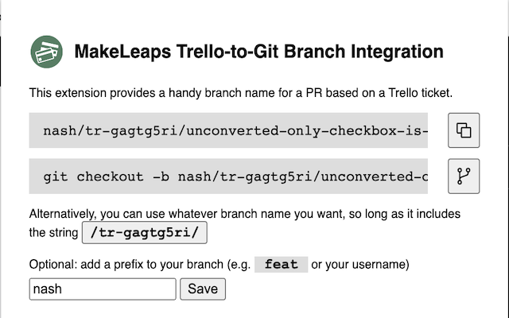
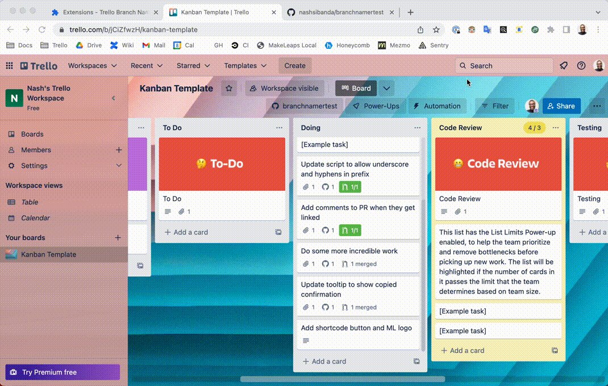

# MakeLeaps Trello-to-Git Branch Namer

This extension allows for the easy creation of a name for new branches in our repositories, that are compatible with the Github Action.

## Usage

1. Install the extension by following the [load unpacked extension](https://developer.chrome.com/docs/extensions/mv3/getstarted/development-basics/#load-unpacked) instructions from Chrome.
   1. Use this directory (`/chrome_extension`) as the extension directory.
2. Navigate to a Trello card
3. Click the extension icon in your browser's toolbar; you'll see a screen like the one shown in the screenshot.
   1. There are two gray text areas:
      1. The top displays the generated branch name
      2. The bottom displays a command to checkout a git branch with this name
4. Make a new branch and happy coding!

